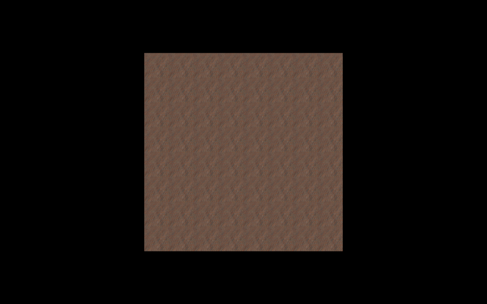
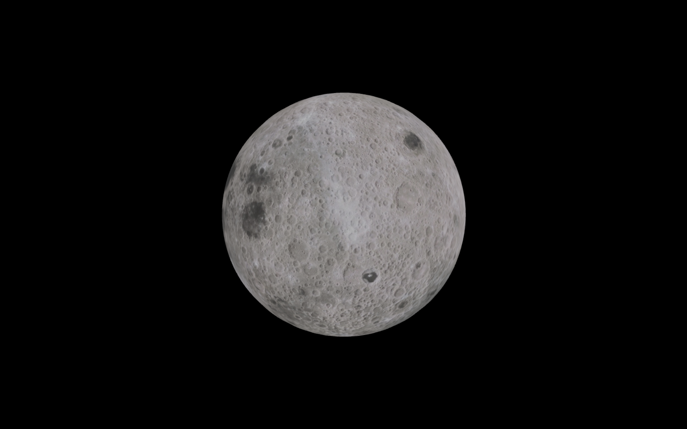

# Day 3: Learning Three.js

## Overview:
In this session, I focused on understanding key concepts in Three.js, including geometry, materials, textures, the clock for animations, and the use of groups. I completed two practical tasks where I applied these concepts to load textures and interact with 3D objects.

---

## Topics Covered:

### 1. **Group in Three.js**:
   - A `Group` in Three.js is a collection of objects (meshes, lights, cameras, etc.) that can be treated as a single object. It allows for efficient management of multiple objects in the scene. When you manipulate the group (move, rotate, scale), it affects all the objects inside it. This is useful when creating complex objects or animations with multiple components.
   - **Example Use Case**: Grouping a set of objects to move them together, such as rotating a solar system where each planet is an individual mesh but all are grouped under a parent object.

### 2. **Geometry**:
   - **Geometry** in Three.js defines the shape of 3D objects. Each geometry consists of a set of vertices, edges, and faces. Common geometries include `BoxGeometry`, `SphereGeometry`, and `PlaneGeometry`. 
   - **Example Use Case**: `THREE.SphereGeometry()` is used to create spherical shapes, such as planets or balls, and `THREE.PlaneGeometry()` is commonly used for creating flat surfaces like floors, walls, or billboards.

### 3. **Clock**:
   - The `THREE.Clock` class is used to track the passage of time in Three.js. This is useful for creating animations or effects that depend on real-time, such as continuous movement or rotating objects.
   - **Example Use Case**: A rotating object or an animation where the time-based motion is controlled to remain consistent regardless of the frame rate.

### 4. **Material**:
   - Materials define how the surfaces of 3D objects appear when rendered. There are different types of materials like `MeshBasicMaterial`, `MeshStandardMaterial`, and `MeshPhysicalMaterial`, each having different properties for how they interact with lights, shadows, and reflections.
   - **Example Use Case**: `MeshPhysicalMaterial` is commonly used for realistic rendering as it allows for realistic reflections, lighting interactions, and texture mapping.

### 5. **Textures**:
   - Textures are images applied to 3D objects to make them look realistic. They can represent the color, surface roughness, or even the bumps on an object. Textures are mapped to the geometry using UV mapping. Common types of textures include **diffuse maps** (for color), **bump maps** (for surface detail), and **normal maps** (for more detailed surface interaction).
   - **Example Use Case**: Applying a texture to a sphere to represent the surface of the moon.

---

## Tasks Completed:

### Task 1: Load a Brick Wall Texture into a Plane Geometry
- **Objective**: I loaded a brick wall texture onto a `PlaneGeometry` and added lighting to make the texture more realistic.
  
- **Steps Taken**:
  1. Created a `PlaneGeometry` object with dimensions to represent a flat surface.
  2. Loaded a brick wall texture using `THREE.TextureLoader()`.
  3. Applied the texture to the plane using `THREE.MeshPhysicalMaterial()`.
  4. Added **AmbientLight** for basic illumination and **PointLight** to add highlights and shadows for realism.

- **Outcome**: The brick wall texture was applied successfully, and the scene lighting gave the texture a realistic appearance.

#### Output:
  
_Above is the output of Task 1 showing the brick wall texture applied to the plane geometry with lighting for realism._

---

### Task 2: Create a Sphere Geometry and Apply a Moon Surface Texture
- **Objective**: I created a sphere geometry and applied a moon surface texture to it. This simulates a moon-like surface on the sphere.

- **Steps Taken**:
  1. Created a `THREE.SphereGeometry()` to represent the shape of the moon.
  2. Loaded a moon surface texture and applied it to the sphere using `THREE.MeshPhysicalMaterial()`.
  3. Positioned the camera and added `OrbitControls` to allow interaction with the scene.
  4. Rotated the sphere for better visualization of the texture.

- **Outcome**: The moon surface texture was successfully applied to the sphere, creating a visually accurate representation of the moon. The sphere can be rotated to view it from different angles.

#### Output:
  
_Above is the output of Task 2 showing the sphere with a moon surface texture applied, making the sphere appear like the moon._

---

## Code Repository:
The source code for both tasks is available in the repository. You can clone or download the repository to see how each task was implemented.

[GitHub Repository Link](https://github.com/100rabhdwivedi/Three-js-Learning)

---

## Further Learning:
- **Three.js Documentation**: [https://threejs.org/docs/](https://threejs.org/docs/)
- **Three.js Examples**: [https://threejs.org/examples/](https://threejs.org/examples/)

---

## Conclusion:
This day’s learning covered important concepts in Three.js such as geometry, materials, and textures. I applied these concepts by creating 3D objects like a brick wall and the moon’s surface. As I move forward, I will continue exploring other features of Three.js and work on more advanced animations and effects.

---

