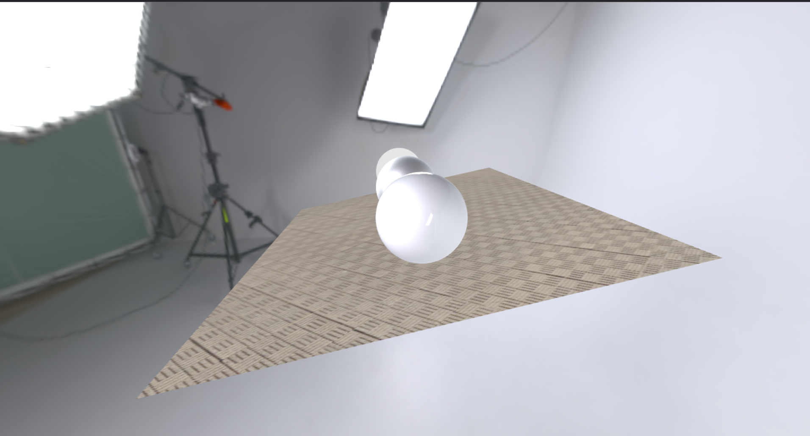

# Day 4: Creating a Realistic Reflective Room with Three.js

In Day 4 of my Three.js learning journey, I focused on creating a realistic reflective room scene by using advanced materials, textures, and environment mapping. This task helped me explore concepts like material properties, reflection, roughness, and transparency, alongside HDR environment maps for realism.

---

## Topics Covered

### 1. **Scene Setup**
   - **Scene Creation**: Used `THREE.Scene()` to create the container for all objects, lights, and cameras.
   - **Camera**: Configured a `PerspectiveCamera` with parameters to mimic a human-eye view. 
     ```javascript
     const camera = new THREE.PerspectiveCamera(
       80,
       window.innerWidth / window.innerHeight,
       0.1,
       1000
     );
     camera.position.z = 9;
     ```
   - **Renderer**: Used `WebGLRenderer` for rendering the 3D content onto a `canvas`.

### 2. **Loading Textures**
   - **Texture Loader**: Loaded a concrete tile texture for the floor using `THREE.TextureLoader`.
     ```javascript
     const textureLoader = new THREE.TextureLoader();
     const text = textureLoader.load('./concrete_tiles.webp');
     ```

   - **HDR Environment Map**: Loaded a high dynamic range (HDR) image using `RGBELoader` to create realistic lighting and reflections.
     ```javascript
     const rgbeLoader = new RGBELoader();
     rgbeLoader.load('https://dl.polyhaven.org/file/ph-assets/HDRIs/hdr/1k/studio_small_08_1k.hdr', (texture) => {
         texture.mapping = THREE.EquirectangularReflectionMapping;
         scene.environment = texture; 
         scene.background = texture;
     });
     ```

### 3. **Creating the Floor**
   - Used `PlaneGeometry` and a textured material to create a realistic floor with tile-like visuals.
   - Applied double-sided rendering to ensure visibility from both sides.
     ```javascript
     const floorgeometry = new THREE.PlaneGeometry(10, 10, 30, 30);
     const floormaterial = new THREE.MeshBasicMaterial({
       map: text,
       metalness: 0.2,
       roughness: 0.2,
       side: THREE.DoubleSide,
     });
     const floor = new THREE.Mesh(floorgeometry, floormaterial);
     floor.rotation.x = -Math.PI / 2 + 0.2;
     scene.add(floor);
     ```

### 4. **Creating Spheres with Different Materials**
   - **Metallic Sphere**: A sphere with reflective metallic properties.
     ```javascript
     const metallicmaterial = new THREE.MeshBasicMaterial({
       metalness: 0,
       roughness: 0,
       transparent: true,
       opacity: 0.7,
     });
     ```
   - **Rough Metal Sphere**: A sphere with increased roughness to create a matte metallic look.
     ```javascript
     const roughMetalMaterial = new THREE.MeshStandardMaterial({
       metalness: 1,
       roughness: 0.5,
     });
     ```
   - **Glass Sphere**: A transparent sphere mimicking glass using `MeshPhysicalMaterial`.
     ```javascript
     const glassMaterial = new THREE.MeshPhysicalMaterial({
       metalness: 0,
       roughness: 0,
       transparency: true,
       opacity: 0.6,
       ior: 1.5,
     });
     ```

### 5. **Camera Controls**
   - Added `OrbitControls` for interactive control of the camera's position and orientation.
     ```javascript
     const controls = new OrbitControls(camera, renderer.domElement);
     ```

### 6. **Animation Loop**
   - Created an animation loop using `requestAnimationFrame` to render the scene continuously.
     ```javascript
     function animate() {
       window.requestAnimationFrame(animate);
       renderer.render(scene, camera);
       controls.update();
     }
     animate();
     ```

---

## Output

The scene includes:
- A tiled floor with a concrete texture.
- Three spheres:
  - **Metallic Sphere**: Semi-transparent with high reflectivity.
  - **Rough Metal Sphere**: Matte and metallic.
  - **Glass Sphere**: Transparent and refractive like real glass.
- HDR environment lighting, making the scene highly realistic.

### Screenshot


---

## Key Learnings
- The significance of HDR environment maps for realistic lighting and reflections.
- Understanding material properties like `metalness`, `roughness`, `opacity`, and `ior`.
- Managing textures and balancing realism with performance.
- Using `OrbitControls` for better interactivity.

---

### What's Next?
On Day 5, I plan to dive deeper into lighting techniques and do more tasks.

---

Stay tuned for more updates on my [GitHub Repository](https://github.com/100rabhdwivedi/Three-js-Learning).
